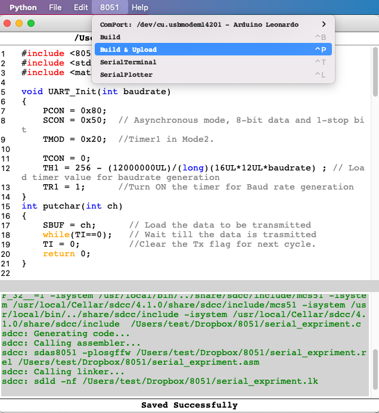
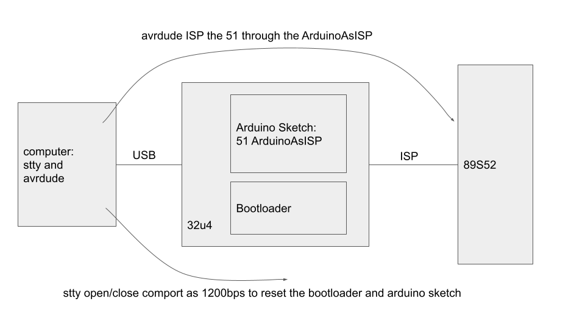

# simple51ide
simple IDE for AT89S52  
## 前言  
這是一個簡單風格的AT89S51/52專用整合開發環境  
  
AT89S系列MCU是ATMEL公司開發的MCS-51族系單晶片  
可線上燒錄程式（ISP）是它的一大特點  
本計畫使用Arduino As ISP，讓Arduino作為AT89S單晶片的程式上傳器  
並且使用python程式建構一個整合開發環境（IDE）  
這個IDE的規劃理念是：讓第一個範例程式以最快時間上傳運作  
因此讓過程中的設定步驟以預設值的方式存在  
以期待對使用者的干擾降到最低  
  
## 特點  
  
1.帶有c語言文法著色的文字編輯器  
2.搭配SDCC進行c語言編譯  
3.搭配修改過的ArduinoAsISP進行單晶片程式上傳  
4.修改過的ArduinoAsISP可作為串列埠中繼，將單晶片的串列埠資料傳送到電腦  
5.內建串列埠監視視窗，可顯示來自單晶片的串列埠資料  
6.（計畫中）內建串列埠資料繪圖器，將串列埠資料即時繪製圖形  

## 原理  
### 程式上傳器  
程式上傳器（ArduinoAsISP）運作原理圖  
  
這個ArduinoAsISP有修改過  
可以讓ArduinoAsISP除了原本的程式上傳功能外  
還可以自動切換成串列埠資料中繼站  
注意！！  
這裡的ArduinoAsISP一定要使用核心為32u4的Arduino  
程式上傳器的接線圖    
  
### 整合開發環境（IDE）  
IDE本身使用python語言開發  
整體使用tk圖形化介面為架構  
搭配外部工具 c語言編譯器SDCC 以及 AVR上傳程式avrdude  

### 使用方法  
目前還在開發階段  
主程式 simple51ide.py  
須自行處理程式庫相依性問題  
另外sdcc與avrdude也要另行下載安裝  
程式下載器必須使用32u4核心的arduino  

## 注意事項  
